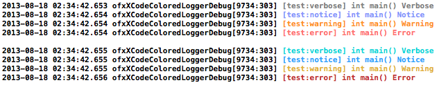

ofxXcodeColoredLogger
=====================

## install

1. Close XCode.
2. Run ./install.sh or manually move XcodeColors.xcplugin to your ~/Library/Application Support/Developer/Shared/Xcode/Plug-ins directory.

[XcodeColors](https://github.com/robbiehanson/XcodeColors)

## exmaple

    #include "ofxXCodeColoredLoggerChannel.h"

    int main()
    {
        // setup ofxXCodeColoredLogger
    	ofSetLoggerChannel(ofxXCodeColoredLoggerChannel::create());
        ofSetLogLevel(OF_LOG_VERBOSE);
        
        // automatically colored log
        ofLogVerbose("test")  << __PRETTY_FUNCTION__  << " Verbose";
        ofLogNotice("test")   << __PRETTY_FUNCTION__  << " Notice";
        ofLogWarning("test")  << __PRETTY_FUNCTION__  << " Warning";
        ofLogError("test")    << __PRETTY_FUNCTION__  << " Error";
                
        // custom color
        ofPtr<ofxXCodeColoredLoggerChannel> channel = ofxXCodeColoredLoggerChannel::create();
        channel->setColor(OF_LOG_VERBOSE, ofColor::darkTurquoise);
        channel->setColor(OF_LOG_NOTICE, ofColor::dodgerBlue);
        channel->setColor(OF_LOG_WARNING, ofColor::goldenRod);
        channel->setColor(OF_LOG_ERROR, ofColor::fireBrick);
        ofSetLoggerChannel(channel);
                        
        ofLogVerbose("test")  << __PRETTY_FUNCTION__  << " Verbose";
        ofLogNotice("test")   << __PRETTY_FUNCTION__  << " Notice";
        ofLogWarning("test")  << __PRETTY_FUNCTION__  << " Warning";
        ofLogError("test")    << __PRETTY_FUNCTION__  << " Error";
    }
    
    
#screenshot

	

